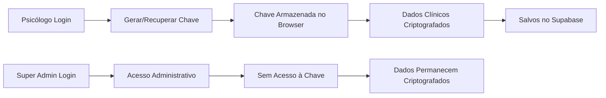

# Arquitetura de Segurança - Tera IA

## Visão Geral

A Tera IA implementa uma arquitetura de segurança em camadas com foco em **privacidade de dados clínicos** e **gestão administrativa segura**.

## Princípios Fundamentais

### 1. Separação de Responsabilidades

- **Super Admins (Gestão)**: Acesso total a dados administrativos, **ZERO** acesso a dados clínicos
- **Psicólogos**: Acesso completo aos próprios dados clínicos criptografados

### 2. Criptografia End-to-End

Todos os dados sensíveis (notas de sessão, prontuários) são criptografados com chave pessoal do psicólogo que **nunca** é armazenada no servidor.

## Sistema de Roles

### Tabela: `user_roles`

```sql
CREATE TYPE app_role AS ENUM ('super_admin', 'psychologist');

CREATE TABLE user_roles (
  id UUID PRIMARY KEY,
  user_id UUID REFERENCES auth.users(id),
  role app_role NOT NULL,
  created_by UUID REFERENCES auth.users(id)
);
```

### Funções de Segurança

```sql
-- Verifica se usuário tem determinada role
CREATE FUNCTION has_role(_user_id UUID, _role app_role)
RETURNS BOOLEAN
SECURITY DEFINER
SET search_path = public;

-- Verifica se é super admin
CREATE FUNCTION is_super_admin(_user_id UUID)
RETURNS BOOLEAN
SECURITY DEFINER
SET search_path = public;
```

## Políticas RLS por Tabela

### Profiles (Dados Administrativos)
- ✅ Super admins podem ver todos
- ✅ Super admins podem editar todos
- ✅ Psicólogos veem apenas o próprio perfil

### Patients (Dados Administrativos)
- ✅ Super admins podem ver todos os pacientes
- ❌ Super admins **NÃO** podem ver dados clínicos (criptografados)
- ✅ Psicólogos veem apenas os próprios pacientes

### Sessions (Metadados)
- ✅ Super admins podem ver metadados (datas, valores)
- ❌ Campo `notes` sempre criptografado
- ✅ Psicólogos têm acesso completo

### Patient Notes (Dados Clínicos)
- ❌ Super admins **NUNCA** têm acesso
- ✅ Apenas o psicólogo proprietário pode acessar
- ✅ Conteúdo sempre criptografado

## Criptografia End-to-End

### Fluxo de Criptografia



### Implementação

**Algoritmo**: AES-GCM (256 bits)
**Armazenamento da Chave**: localStorage do browser (apenas)
**Localização**: `src/utils/encryption.ts`

### Funções Principais

```typescript
// Gerar nova chave
generateEncryptionKey(): Promise<CryptoKey>

// Criptografar dados
encryptData(data: string, key: CryptoKey): Promise<string>

// Descriptografar dados
decryptData(encryptedData: string, key: CryptoKey): Promise<string>

// Limpar chave (logout)
clearEncryptionKey(): void
```

## Hooks React

### `useRole()`
Verifica permissões do usuário atual

```typescript
const { isSuperAdmin, isPsychologist } = useRole();
```

### `useEncryption()`
Gerencia criptografia de dados sensíveis

```typescript
const { encrypt, decrypt, isInitialized } = useEncryption();
const encrypted = await encrypt("dados sensíveis");
const decrypted = await decrypt(encrypted);
```

### `useUserManagement()`
Gerencia usuários e roles (apenas super admins)

```typescript
const { users, addRole, removeRole } = useUserManagement();
```

## Interface de Gestão

### Rota: `/gestao`

Página exclusiva para super admins com:
- Visualização de todos os usuários
- Atribuição/remoção de roles
- **NUNCA** exibe dados clínicos

### Proteção da Rota

```typescript
// No Sidebar - link só aparece para super admins
const { isSuperAdmin } = useRole();
const navigationItems = [
  ...navigation,
  ...(isSuperAdmin ? [{ name: "Gestão", href: "/gestao" }] : [])
];
```

## Fluxo de Dados

### Dados Administrativos
```
Psicólogo → Supabase → RLS Policy Check → Super Admin ✅
```

### Dados Clínicos
```
Psicólogo → Criptografia Local → Supabase (encrypted) → Super Admin ❌
                ↓
         Descriptografia Local
                ↓
         Psicólogo Visualiza
```

## Boas Práticas

### ✅ O que Fazer

1. **Sempre** usar `useEncryption()` para dados clínicos
2. **Sempre** verificar roles antes de exibir interfaces sensíveis
3. **Sempre** limpar chave de criptografia no logout
4. **Sempre** validar permissões no backend (RLS)

### ❌ O que NÃO Fazer

1. **NUNCA** armazenar chave de criptografia no servidor
2. **NUNCA** enviar dados clínicos sem criptografia
3. **NUNCA** confiar apenas em verificações client-side
4. **NUNCA** logar dados sensíveis no console

## Considerações de Segurança

### Armazenamento da Chave

**Atual**: localStorage (desenvolvimento)
**Recomendado para Produção**:
- Hardware Security Module (HSM)
- Senha mestre do usuário
- Biometria + secure enclave

### Backup da Chave

⚠️ **CRÍTICO**: Se o usuário perder a chave, os dados são **irrecuperáveis**.

Soluções recomendadas:
1. Export seguro da chave protegido por senha
2. Key recovery com multiple factors
3. Backup em dispositivo confiável

### Conformidade

- ✅ **LGPD**: Dados sensíveis criptografados, acesso restrito
- ✅ **CFP**: Sigilo profissional mantido tecnicamente
- ✅ **Privacidade**: Nem a gestão acessa dados clínicos

## Alertas de Segurança Restantes

Os seguintes avisos do Supabase Linter não estão relacionados ao código da aplicação:

1. **Function Search Path Mutable**: Todas as funções criadas já têm `SET search_path = public`
2. **Auth OTP long expiry**: Configuração do Supabase Auth (ajustar manualmente)
3. **Leaked Password Protection**: Ativar nas configurações do Supabase
4. **Postgres version**: Atualizar Postgres nas configurações do Supabase

## Próximos Passos

### Melhorias Recomendadas

1. **Key Management**: Implementar sistema de recovery de chave
2. **Audit Logs**: Registrar todos os acessos administrativos
3. **Multi-Factor Auth**: Adicionar 2FA para super admins
4. **Rotação de Chaves**: Implementar re-encryption periódica
5. **Device Trust**: Validar dispositivos confiáveis para acesso

## Contato

Para questões de segurança, entre em contato com a equipe de desenvolvimento.

---

**Última atualização**: 2025-09-29
**Versão**: 1.0.0
